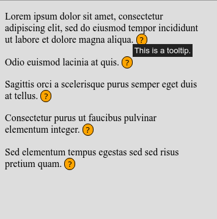
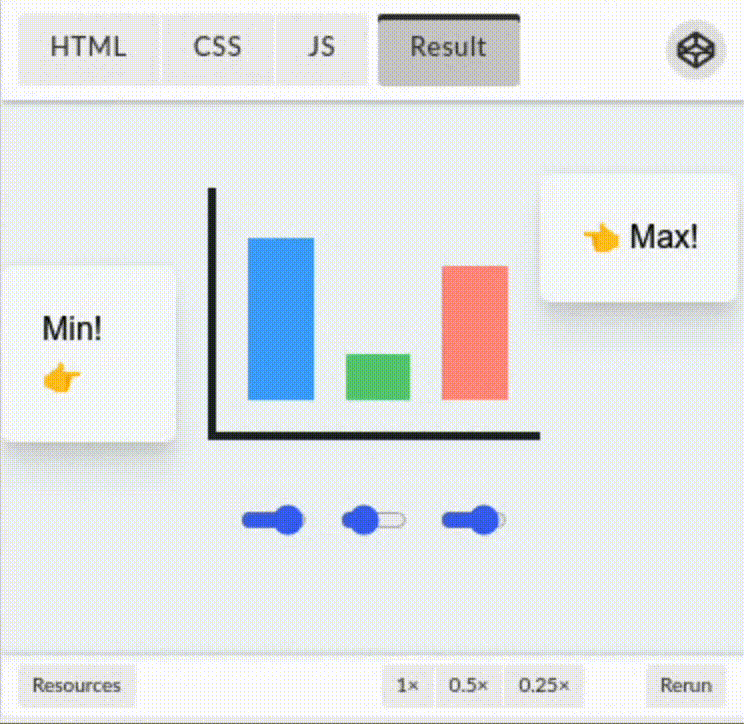

<link rel="stylesheet" href="../common/explainer-common.css">

# CSS Anchor Positioning Explainer

[CSS Anchor positioning](https://drafts.csswg.org/css-anchor-position-1/) is a
CSS feature that allows an element to position and size itself relative to one
or more "anchor elements" elsewhere on the page. A typical use case is to "pin"
a tooltip to something that triggers it.

This is a short explainer covering the basics of the feature. See also:
- [Chrome Developers article](https://developer.chrome.com/blog/tether-elements-to-each-other-with-css-anchor-positioning)
  for a comprehensive introduction
- [Spec](https://drafts.csswg.org/css-anchor-position-1/) for the full technical
  details.

## The Basics

First, add an
[`anchor-name`](https://drafts.csswg.org/css-anchor-position-1/#propdef-anchor-name)
to the anchor element:

```css
.anchor {
  anchor-name: --my-anchor;
}
```

Then, use the
[`anchor()`](https://drafts.csswg.org/css-anchor-position-1/#anchor-pos)
function to put another element below the anchor:

```css
.target {
  position: fixed;             /* Must be position: fixed or absolute *
  left: anchor(right);         /* Aligns left edge with anchor's right edge */
  bottom: anchor(top);         /* Aligns bottom edge with anchor's top edge */
  anchor-default: --my-anchor; /* Sets the default target of the anchor() function */
}
```

| <iframe class="demo" src="./anchor-basic.html"></iframe> |  |
| :-----------: | :----------: |
| **Live Demo** | **Rendered** |

**Notes:**
- Anchor positioning works by evaluating the `anchor()` functions into pixel
  values, and then run
  [CSS Positioned Layout](https://developer.mozilla.org/en-US/docs/Web/CSS/CSS_Positioning).
- There's also an
  [`anchor-size()`](https://drafts.csswg.org/css-anchor-position-1/#anchor-size)
  function that allows sizing an element with the dimensions of the anchor
  element.

## Fallback Positions

We often want to keep an anchor-positioned element within viewport (if
possible), while we don't know the anchor's location in advance or it can be
moved by scrolling.  This can be achieved by setting a list of [fallback
positions](https://drafts.csswg.org/css-anchor-position-1/#fallback).

In this example, we will first try to place the target below the anchor, but if
that overflows the viewport, then move it above:

```css
.target {
  position: fixed;
  left: anchor(right);
  anchor-default: --my-anchor;
  position-fallback: --top-then-bottom;
}

@position-fallback --top-then-bottom {
  @try { bottom: anchor(top); }
  @try { top: anchor(bottom); }
}
```

| <iframe class="demo" src="./position-fallback.html"></iframe> |  |
| :-----------: | :----------: |
| **Live Demo** | **Rendered** |

**Note**: Setting `position: absolute` will keep the element within its
[containing block](https://drafts.csswg.org/css-position-3/#def-cb) instead of
the viewport.

## Using Multiple Anchor Elements

The `anchor()` and `anchor-size()` functions can optionally take an anchor name
parameter, so that they are solved against the provided anchor instead of the
default anchor. This allows us to anchor to multiple elements and create more
complicated layout.

In this example (stolen from
[Jhey Tompkins](https://developer.chrome.com/blog/tether-elements-to-each-other-with-css-anchor-positioning/#bar-chart-calc)),
we create min and max value indicators in a bar chart:

```css
.max-indicator {
  position: fixed;
  left: anchor(--chart right);
  bottom: max(
    anchor(--anchor-1 top),
    anchor(--anchor-2 top),
    anchor(--anchor-3 top)
  );
}
```

| <iframe class="demo" src="https://codepen.io/web-dot-dev/embed/PoeNKXJ?height=450&amp;theme-id=light&amp;default-tab=result&amp;editable=true" title="Pen PoeNKXJ by web-dot-dev on Codepen" loading="lazy" allow="camera;clipboard-read; clipboard-write; encrypted-media; geolocation; microphone;midi;">See the Pen <a href="https://codepen.io/web-dot-dev/embed/PoeNKXJ">Pen PoeNKXJ by web-dot-dev on Codepen</a></iframe> |  |
| :-----------: | :----------: |
| **Live Demo** | **Rendered** |

**Note**: If `anchor-default` is not set and scrolling is relevant, we need to set the
  [`anchor-scroll`](https://drafts.csswg.org/css-anchor-position-1/#propdef-anchor-scroll)
  property to specify which anchor to should scroll with.
